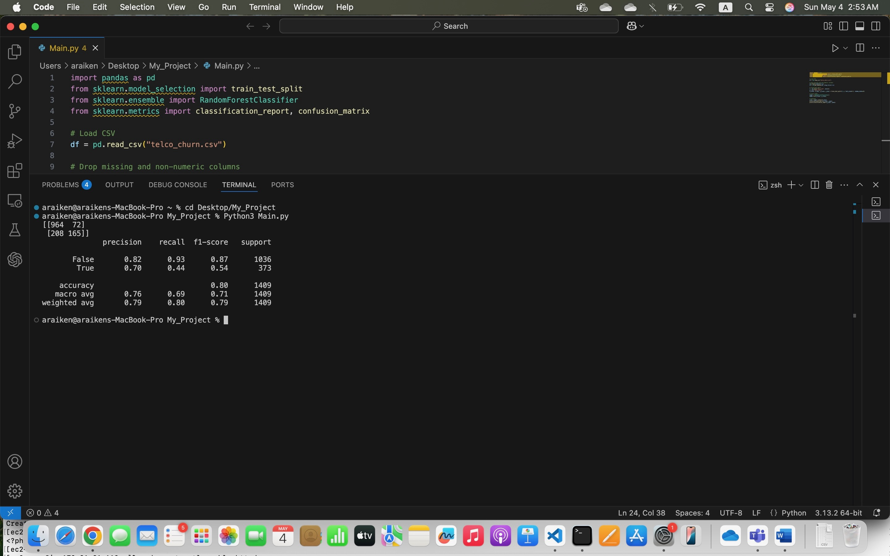

# Telco Churn Predictor 

A machine learning model that predicts customer churn using the Telco Customer dataset.

## Tools Used
- Python
- Pandas, Scikit-learn
- Confusion Matrix & Classification Report
- Dataset from Kaggle

## Files
- `Main.py` – Model training + prediction script
- `telco_churn.csv` – Dataset
- `Result.jpeg` – Output screenshot (confusion matrix and metrics)

## Output

